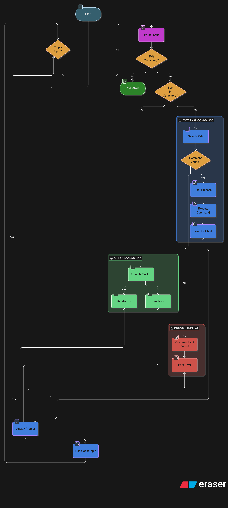

# Simple Shell - shell

A simple UNIX command line interpreter written in C, replicating the behavior of `/bin/sh`.

---

## Table of Contents

- [Description](#description)
- [Requirements](#requirements)
- [Installation](#installation)
- [Usage](#usage)
- [Features](#features)
- [Built-in Commands](#built-in-commands)
- [Examples](#examples)
- [Files](#files)
- [Authors](#authors)

---

## Description

`shell` is a simple UNIX shell written in C as part of the Holberton School curriculum.
It reads commands from standard input (interactive or non-interactive mode),
searches for executables using the `PATH` environment variable, and executes them
via `fork` and `execve`. It aims to replicate the behavior and output of `/bin/sh`.

---

## Requirements

- Ubuntu 20.04 LTS
- GCC compiler
- Compiled with: `-Wall -Werror -Wextra -pedantic -std=gnu89`

---

## Installation

Clone the repository and compile:

```bash
git clone https://github.com/BlackGhostMatrixx555/holbertonschool-simple_shell.git
cd holbertonschool-simple_shell
gcc -Wall -Werror -Wextra -pedantic -std=gnu89 *.c -o shell
```

---

## Usage

### Interactive mode

```bash
$ ./shell
($) /bin/ls
shell main.c shell.c
($)
($) exit
$
```

### Non-interactive mode

```bash
$ echo "/bin/ls" | ./shell
shell main.c shell.c
$ cat commands.txt | ./shell
shell main.c shell.c
shell main.c shell.c
```

---

## Features

- Displays a prompt and waits for user input
- Executes commands found via the `PATH` environment variable
- Handles commands with arguments
- Works in both interactive and non-interactive mode
- Handles end-of-file (`Ctrl+D`)
- Prints error messages matching `/bin/sh` behavior (with `argv[0]` as program name)
- No memory leaks

---

## Built-in Commands

| Command | Description |
|---------|-------------|
| `exit` | Exit the shell |
| `env`  | Print the current environment |

---

## Examples

```bash
($) /bin/echo Hello, World!
Hello, World!

($) ls -la
total 48
drwxr-xr-x ...

($) nonexistent_command
./shell: 1: nonexistent_command: not found

($) exit
```

---

## Error Handling

When a command is not found, `shell` prints an error in the following format:

```
./shell: 1: command: not found
```

This matches the behavior of `/bin/sh`, replacing the shell name with `argv[0]`.


---

## Flowchart



---

## Files

| File | Description |
|------|-------------|
| `main.c` | Entry point and main loop |
| `shell.c` | Prompt, read_line, resolve and execute commands |
| `args.c` | split_line() — tokenizes the input line |
| `path.c` | find_in_path() — PATH resolution |
| `builtins.c` | Built-in commands: exit, env |
| `utils.c` | Utility functions: _strlen, _strdup, _getenv |
| `free.c` | Memory management: free_args, free_path |
| `shell.h` | Header file with all prototypes and includes |
| `README.md` | Project documentation |
| `man_1_simple_shell` | Manual page for shell |
| `AUTHORS` | List of contributors |

---

## Authors

- **Thélyaan Dufrénoy** — [thelyaan444@hotmail.com](mailto:thelyaan444@hotmail.com) — GitHub: [BlackGhostMatrixx555](https://github.com/BlackGhostMatrixx555)

---

## License

This project is part of the Holberton School curriculum. No license.
